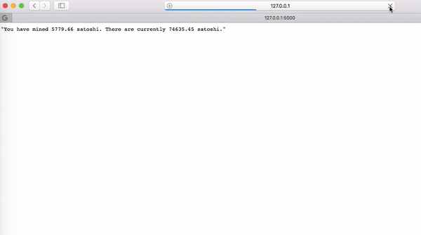

# Bitcoin Miner API

To run this API, simply run the following in your console:

```
$ python main.py
```

Go to http://127.0.0.1:5000/ to see your satoshi grow!



(Disclaimer: Does not actually mine Bitcoin, but does use CPU power.)

Created for the Hack Club Ridiculous API Challenge.
